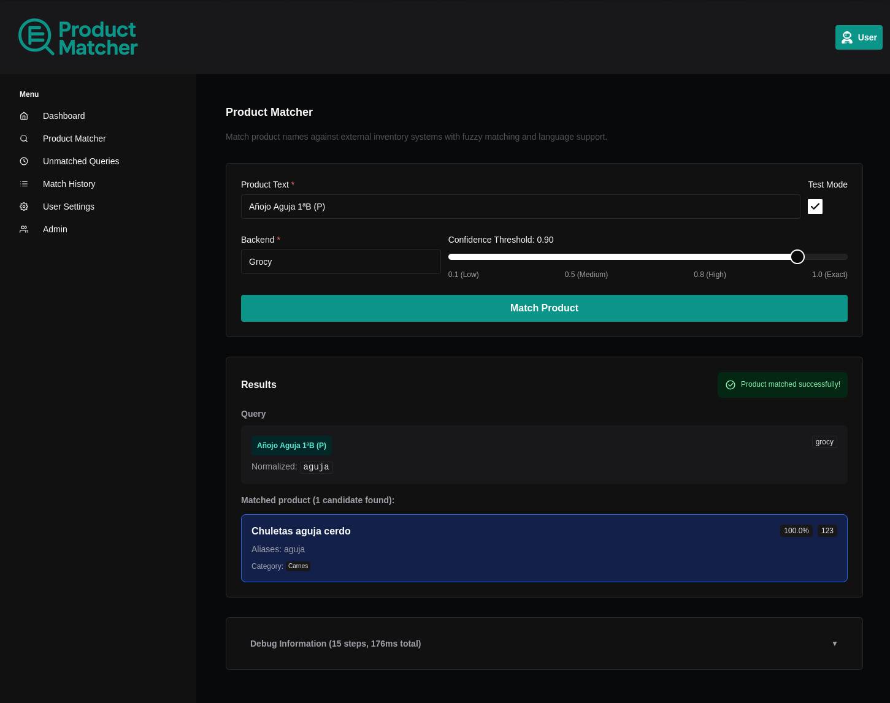

# ProductMatcher

A flexible, multilingual, backend-agnostic service for mapping free-text product names (e.g., from store receipts) to canonical inventory items. ProductMatcher normalizes input strings internally, performs fuzzy matching, and learns new aliases over time through an interactive resolution interface.



## Key Features

- 🔍 **Intelligent Product Matching** Advanced fuzzy matching with configurable confidence thresholds
- 🌍 **Multi-language Support** Built-in normalization for English, Spanish, and extensible language system
- 🔌 **Backend Adapters** Plug-in architecture supporting Grocy, custom ERP systems, and more
- 📝 **Interactive Resolution** Web-based interface for resolving ambiguous matches

## How ProductMatcher Works

1. **Input Processing**: Receive free-text product names from receipts, invoices, or manual entry
2. **Normalization**: Apply language-specific normalization (lowercase, accent removal, lemmatization)
3. **Fuzzy Matching**: Compare against known product names and aliases using advanced similarity algorithms
4. **Confidence Scoring**: Return matches above threshold or flag for manual resolution
5. **Interactive Resolution**: Present ambiguous matches to users through web interface
6. **Learning**: Store confirmed matches as aliases to improve future accuracy

## Supported Backends

- **Grocy** - Popular home inventory management system
- **Mock Adapter** - For testing and development
- **Custom Adapters** - Extensible plugin system for any inventory system

## Quick Start

1. **Download the simple compose file:**
   ```bash
   curl -o docker-compose.yml https://raw.githubusercontent.com/miguelangel-nubla/product-matcher/master/docker-compose.simple.yml
   ```

2. **Start the application:**
   ```bash
   docker compose up -d
   ```

3. **Access the application:**
   - Frontend: http://localhost:3000

## Default Credentials

- **Admin User:** admin@example.com
- **Admin Password:** changethis

## Configuration

### Backend Adapters

Configure your inventory systems in `backend/app/config/backends.yaml`:

```yaml
backends:
  grocy:
    description: "Grocy home inventory system"
    language: "en"
    adapter:
      type: "grocy"
      config:
        base_url: "https://your-grocy-instance.com"
        api_key: "your-grocy-api-key"
        external_url: "https://your-grocy-instance.com"

settings:
  default_threshold: 0.8    # Default matching threshold (0.0-1.0)
  max_candidates: 5         # Maximum candidates to return
```

### Language Settings

ProductMatcher supports multiple languages with customizable normalization:

- **English** (`en`): Full normalization with lemmatization
- **Spanish** (`es`): Specialized normalization for Spanish text
- **Custom Languages**: Add new languages in `backend/app/services/normalization/`

## API Usage

### Match a Product

```bash
curl -X POST "http://localhost:8000/api/v1/matching/match" \
  -H "Authorization: Bearer YOUR_TOKEN" \
  -H "Content-Type: application/json" \
  -d '{
    "text": "organic red apples",
    "backend": "grocy",
    "threshold": 0.8,
  }'
```

## Development

### Backend Development

```bash
cd backend
uv venv
source .venv/bin/activate
uv sync
uv run uvicorn app.main:app --reload
```

### Frontend Development

```bash
cd frontend
npm install
npm run dev
```

## Creating Custom Adapters

Extend ProductMatcher to work with your inventory system:

```python
from app.adapters.base import ProductDatabaseAdapter, ExternalProduct

class MyCustomAdapter(ProductDatabaseAdapter):
    @classmethod
    def from_config(cls, **config_kwargs):
        return cls(api_url=config_kwargs["api_url"])

    def get_all_products(self) -> list[ExternalProduct]:
        # Fetch products from your system
        pass

    def add_alias(self, product_id: str, alias: str) -> tuple[bool, str | None]:
        # Add learned alias to your system
        pass
```

## Deployment

### Production Deployment

1. Update environment variables for production
2. Generate secure secret keys
3. Configure your domain and SSL certificates
4. Deploy with Docker Compose

```bash
# Generate secure keys
python -c "import secrets; print(secrets.token_urlsafe(32))"

# Deploy
docker-compose -f docker-compose.yml up -d
```

### Security Configuration

Before deploying, update these critical settings in `.env`:

- `SECRET_KEY` - JWT signing key
- `FIRST_SUPERUSER_PASSWORD` - Admin password
- `POSTGRES_PASSWORD` - Database password

## Architecture

ProductMatcher uses a clean architecture with:

- **Adapter Pattern** for backend integration
- **Normalization Pipeline** for text processing
- **Fuzzy Matching Engine** with configurable algorithms
- **Pending Resolution System** for interactive learning
- **Multi-language Support** with extensible normalization

## Contributing

1. Fork the repository
2. Create a feature branch
3. Make your changes
4. Add tests for new functionality
5. Submit a pull request

## License

ProductMatcher is licensed under the terms of the MIT license.

## Acknowledgments

Built on the excellent [FastAPI Full Stack Template](https://github.com/fastapi/full-stack-fastapi-template) by [@tiangolo](https://github.com/tiangolo).
